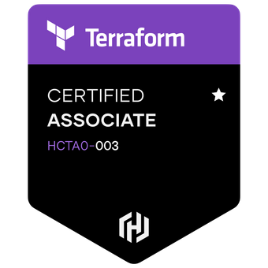

# Terraform Associate Certification (003) Study Guide

A guide for studying towards your Terraform Associate Certification (003) 📚 📖 🎒

## Links

  - [Study guide](https://developer.hashicorp.com/terraform/tutorials/certification-003/associate-study-003)
  - [Exam outline](https://www.hashicorp.com/certification/terraform-associate)
  - [Practise exams from Bryan Krausen](https://www.udemy.com/course/terraform-associate-practice-exam)
  - [Anki](https://ankiweb.net/about)

## Format

### **Structure**

Within each folder there are two different resources:

`n-notes.md` <- cliff notes and questions from the Terraform resources  
`n-cards.md` <- anki cards built from that resources's topics  

### **How the notes are organized**

I am following along closely with the **Exam objectives** found [here](https://www.hashicorp.com/certification/terraform-associate). This way you're not wasting time learning what isn't included on the exams, however in some cases I may have additional learning where I wasn't already familiar with the concept.

For each point under a topic I will make a drop down question, along with sub questions so that the topic can be learnt off of my notes. You can then take a look into the `cards.md` file to build up your spaced repetition deck off of the notes. 

Please bear in mind that in the notes I am directly studying towards the **exam objectives** so that I can most efficiently pass the exam. These notes are not exhaustive and do not properly cover the topics/headings that may be associated with them; they are a direct means of passing the Terraform Associate Certification. As such, you may need a basic understanding of Terraform before starting the study guide.

## Anki Cards (185 cards)

The cards that will go into my [Anki](https://ankiweb.net/about) are located at `./terraform-anki-deck.apkg`, some people find these personal and don't share them, as they are very tailored to the individual who made them, so take that as you will. Obviously I'd recommend you make your own, but I am happy to share. 

## Practise Exams

I would highly recommend that you sit the [practise exams from Bryan Krausen](https://www.udemy.com/course/terraform-associate-practice-exam). The study outlined in this repo took me to an 80% average on his first two practise exams, but by the 5th I was getting 90%+. The practise exams were a close emulation of the real deal. You can find discount codes on [his public repo](https://github.com/btkrausen).

## [Exam Objectives](https://www.hashicorp.com/certification/terraform-associate)

There is an summary drop down of each exam objective inside every `note.md` file for the corresponding topic.

**1	Understand infrastructure as code (IaC) concepts**  
- 1a)	Explain what IaC is
- 1b)	Describe advantages of IaC patterns

**2	Understand the purpose of Terraform (vs other IaC)**
- 2a)	Explain multi-cloud and provider-agnostic benefits
- 2b)	Explain the benefits of state

**3	Understand Terraform basics**
- 3a)	Install and version Terraform providers
- 3b)	Describe plugin-based architecture
- 3c)	Write Terraform configuration using multiple providers
- 3d)	Describe how Terraform finds and fetches providers

**4	Use Terraform outside of core workflow**
- 4a)	Describe when to use terraform import to import existing infrastructure into your Terraform state
- 4b)	Use terraform state to view Terraform state
- 4c)	Describe when to enable verbose logging and what the outcome/value is

**5	Interact with Terraform modules**
- 5a)	Contrast and use different module source options including the public Terraform Module Registry
- 5b)	Interact with module inputs and outputs
- 5c)	Describe variable scope within modules/child modules
- 5d)	Set module version

**6	Use the core Terraform workflow**
- 6a)	Describe Terraform workflow ( Write -> Plan -> Create )
- 6b)	Initialize a Terraform working directory (terraform init)
- 6c)	Validate a Terraform configuration (terraform validate)
- 6d)	Generate and review an execution plan for Terraform (terraform plan)
- 6e)	Execute changes to infrastructure with Terraform (terraform apply)
- 6f)	Destroy Terraform managed infrastructure (terraform destroy)
- 6g)	Apply formatting and style adjustments to a configuration (terraform fmt)

**7	Implement and maintain state**
- 7a)	Describe default local backend
- 7b)	Describe state locking
- 7c)	Handle backend and cloud integration authentication methods
- 7d)	Differentiate remote state back end options
- 7e)	Manage resource drift and Terraform state
- 7f)	Describe backend block and cloud integration in configuration
- 7g)	Understand secret management in state files

**8	Read, generate, and modify configuration**
- 8a)	Demonstrate use of variables and outputs
- 8b)	Describe secure secret injection best practice
- 8c)	Understand the use of collection and structural types
- 8d)	Create and differentiate resource and data configuration
- 8e)	Use resource addressing and resource parameters to connect resources together
- 8f)	Use HCL and Terraform functions to write configuration
- 8g)	Describe built-in dependency management (order of execution based)

**9	Understand Terraform Cloud capabilities**
- 9a)	Explain how Terraform Cloud helps to manage infrastructure
- 9b)	Describe how Terraform Cloud enables collaboration and governance
